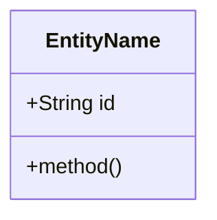
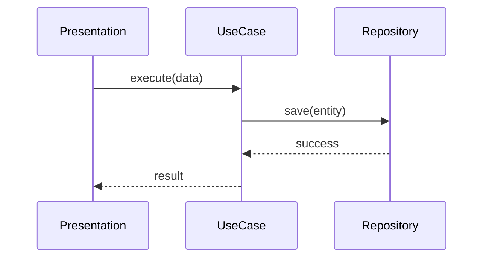

# Implementation Plan: [Feature Name]

**Status**: 🔄 In Progress
**Started**: YYYY-MM-DD
**Last Updated**: YYYY-MM-DD
**Estimated Completion**: YYYY-MM-DD

---

**⚠️ CRITICAL INSTRUCTIONS**: After completing each phase:
1. ✅ Check off completed task checkboxes
2. 🧪 Run all quality gate validation commands
3. ⚠️ Verify ALL quality gate items pass
4. 📅 Update "Last Updated" date above
5. 📝 Document learnings in Notes section
6. ➡️ Only then proceed to next phase

⛔ **DO NOT skip quality gates or proceed with failing checks**

---

## 📋 Overview

### Feature Description
[What this feature does and why it's needed]

### Success Criteria
- [ ] Criterion 1
- [ ] Criterion 2

---

## 🗺️ Context Map
*Agent should read these files before starting implementation to understand the existing context.*

- **Core Entities**: `src/domain/entities/...`
- **Use Cases**: `src/domain/use-cases/...`
- **Repositories/Data**: `src/data/...`
- **UI Components**: `src/presentation/components/...`
- **Existing Tests**: `tests/...`

---

## 🏗️ Architecture & Design

### Visualization (Mermaid)
*Visual representation of the logic and structure.*

#### Class Diagram (Domain Model)


#### Sequence Diagram (Flow)


### Architecture Decisions
| Decision | Rationale | Trade-offs |
|----------|-----------|------------|
| [Decision] | [Why] | [Trade-off] |

---

## 🧪 Test Specification

### Test Scenarios
- [ ] **Scenario 1**: [Description] -> `expect(result).toBe(expected)`
- [ ] **Scenario 2**: [Edge Case] -> `expect(error).toThrow()`

### Coverage Target
- **Domain/Logic**: 100%
- **Presentation**: ≥90%

---

## 🚀 Implementation Phases

### Phase 1: [Phase Name]
**Goal**: [Specific deliverable]
**Estimated Time**: X hours
**Status**: ⏳ Pending

#### Tasks

**🔴 RED: Write Failing Tests First**
- [ ] **Task 1.1**: Create test file at `tests/...`
- [ ] **Task 1.2**: Write failing tests for [Scenario]

**🟢 GREEN: Implement to Make Tests Pass**
- [ ] **Task 1.3**: Implement [Logic/Component]
- [ ] **Task 1.4**: Verify tests pass

**🔵 REFACTOR: Clean Up Code**
- [ ] **Task 1.5**: Improve naming and structure while keeping tests green

#### Quality Gate ✋

**Executable Verification Command:**
```bash
npm test tests/... && npm run lint
```

**Checklist:**
- [ ] All tests in this phase pass
- [ ] Build & Lint pass
- [ ] No regressions in existing features

---

## 📊 Progress Tracking

### Completion Status
- **Phase 1**: ⏳ 0%
- **Phase 2**: ⏳ 0%

**Overall Progress**: 0% complete

---

## 🔄 Rollback Strategy
- **Command**: `git checkout HEAD~1` (or specific revert steps)
- **Files to Restore**: [List of files]

---

## 📝 Notes & Learnings
- [Insights discovered]
- [Blockers resolved]
