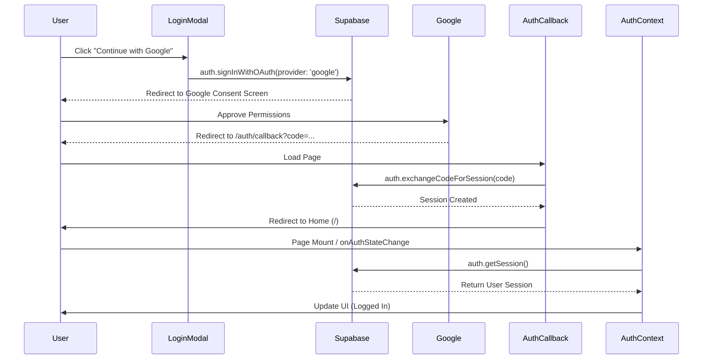

# Implementation Plan: Feature Planner Supabase Integration (v2)

**Status**: 📋 Planned
**Started**: 2026-02-02
**Target Completion**: 2026-02-05

---

**⚠️ CRITICAL INSTRUCTIONS**: After completing each phase:
1. ✅ Check off completed task checkboxes
2. 🧪 Run all quality gate validation commands
3. ⚠️ Verify ALL quality gate items pass
4. 📅 Update "Last Updated" date above
5. 📝 Document learnings in Notes section
6. ➡️ Only then proceed to next phase

⛔ **DO NOT skip quality gates or proceed with failing checks**

---

## 📋 Overview

### Feature Description
쇼핑몰 프로젝트의 인증 및 데이터 관리를 위해 **Supabase**를 도입합니다.
1. **Authentication**: 기존의 Mock Auth를 **Supabase Google OAuth**로 교체하여 실제 소셜 로그인을 구현합니다.
2. **Persistence**: 사용자 세션 및 기본 프로필 정보를 Supabase Auth 및 Database에 연동합니다.
3. **Deployment**: **Vercel**에 프로젝트를 배포하여 실제 환경에서 동작을 검증합니다.

이 작업은 'Feature Planner'라는 에이전트 페르소나의 지휘 하에, 쇼핑몰의 핵심 인프라를 클라우드 네이티브 환경으로 마이그레이션하는 첫 단계입니다.

### Success Criteria
- [ ] **Supabase Project**: 프로젝트 생성 및 `src/lib/supabase` 클라이언트 설정 완료
- [ ] **Google Login**: `LoginModal`에서 구글 로그인 버튼 클릭 시 OAuth 흐름 정상 작동
- [ ] **Session Management**: 새로고침 후에도 로그인 상태 유지 (`AuthContext` + `onAuthStateChange`)
- [ ] **Deployment**: Vercel 배포 URL에서 로그인/로그아웃 기능 정상 동작 확인

### User Impact
- **사용자**: 실제 구글 계정으로 간편하게 로그인 가능 (더 이상 데모용 가짜 로그인이 아님)
- **개발자**: 사용자 데이터를 영구 저장하고 관리할 수 있는 백엔드 인프라 확보

---

## 🏗️ Architecture & Visualization

### Context Map (Files to Touch)
| Category | File Path | Description |
|----------|-----------|-------------|
| **Config** | `.env.local` | Supabase URL 및 Anon Key 환경 변수 |
| **Lib** | `src/lib/supabase/client.ts` | Supabase 클라이언트 인스턴스 생성 (Browser) |
| **Auth** | `src/presentation/context/AuthContext.tsx` | 전역 인증 상태 관리 (Mock -> Supabase) |
| **UI** | `src/presentation/components/LoginModal.tsx` | 로그인 UI (Google 버튼 추가) |
| **Route** | `src/app/auth/callback/page.tsx` | OAuth 리다이렉트 처리 페이지 |
| **Middleware** | `src/middleware.ts` (Optional) | 서버 사이드 세션 보호 (추후 확장 시) |

### OAuth Authentication Flow (Sequence Diagram)

---

## 🚀 Implementation Phases

### Phase 1: Environment & Client Setup
**Goal**: Supabase 연동을 위한 패키지 설치 및 클라이언트 유틸리티 구성
**Estimated Time**: 30 mins

#### Tasks
- [x] **Task 1.1**: 필요한 패키지 설치 (`@supabase/supabase-js`, `@supabase/ssr`)
- [x] **Task 1.2**: `.env.example` 파일 생성 및 환경 변수 정의
- [x] **Task 1.3**: `src/lib/supabase/client.ts` 구현 (Browser Client)
- [x] **Task 1.4**: (User Action) Supabase 프로젝트 생성 및 `.env.local` 값 채우기

#### Executable Quality Gate ✋
- [x] 패키지 설치 확인
- [x] 파일 생성 확인

---

### Phase 2: Auth Implementation (Code Changes)
**Goal**: 기존 Mock Auth 코드를 실제 Supabase Auth 로직으로 교체
**Estimated Time**: 1 hour

#### Tasks
- [x] **Task 2.1**: `src/presentation/context/AuthContext.tsx` 리팩토링
- [x] **Task 2.2**: `src/app/auth/callback/page.tsx` 생성 (OAuth Handler)
- [x] **Task 2.3**: `src/presentation/components/LoginModal.tsx` UI 수정

#### Executable Quality Gate ✋
- [x] 빌드 테스트 통과
- [x] 린트 체크 통과

---

### Phase 3: Verification & Deployment
**Goal**: 로컬에서 동작 확인 후 Vercel에 배포
**Estimated Time**: 1 hour

#### Tasks
- [x] **Task 3.1**: (User Action) Supabase Dashboard에서 Google Provider 설정
- [x] **Task 3.2**: 로컬 서버(`npm run dev`) 실행 후 로그인 테스트
- [ ] **Task 3.3**: (User Action) Vercel 배포 및 환경 변수 설정

#### Executable Quality Gate ✋
- [ ] 브라우저 개발자 도구 > Application > Storage > Local Storage에 `sb-...-auth-token` 키 존재 확인
- [ ] 배포된 URL 접속 시 콘솔 에러 없음

---

## 📊 Progress Tracking

### Completion Status
- **Phase 1**: ⚠️ Partially Complete (User Action Required)
- **Phase 2**: ✅ Code Changes Complete
- **Phase 3**: ⏳ Pending

**Overall Progress**: 60% complete (Waiting for User Config & Deployment)