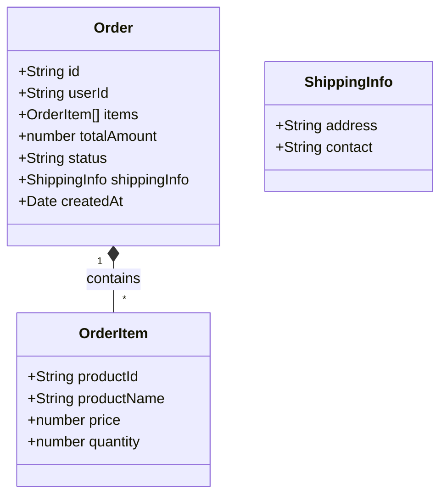
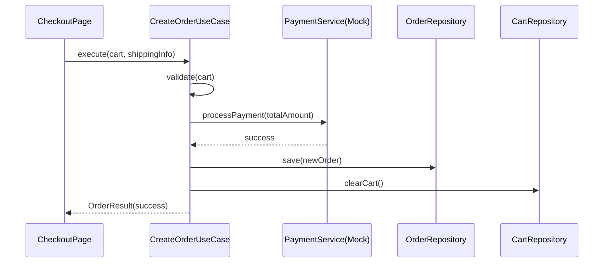

# Implementation Plan: Phase 2 - Commerce MVP (Checkout & Order)

**Status**: 🔄 In Progress
**Started**: 2026-01-31
**Last Updated**: 2026-01-31
**Estimated Completion**: 2026-02-05

---

**⚠️ CRITICAL INSTRUCTIONS**: After completing each phase:
1. ✅ Check off completed task checkboxes
2. 🧪 Run all quality gate validation commands
3. ⚠️ Verify ALL quality gate items pass
4. 📅 Update "Last Updated" date above
5. 📝 Document learnings in Notes section
6. ➡️ Only then proceed to next phase

⛔ **DO NOT skip quality gates or proceed with failing checks**

---

## 📋 Overview

### Feature Description
현재 장바구니에 담긴 상품을 기반으로 배송지 정보를 입력받고, 모의 결제(Mock Payment)를 수행한 뒤 주문을 완료하는 전체 커머스 흐름을 구현합니다. 주문 내역은 LocalStorage에 저장되어 사용자가 언제든 조회할 수 있어야 합니다.

### Success Criteria
- [ ] 체크아웃 페이지(`/checkout`)에서 배송지 입력 및 결제 시도가 가능해야 함
- [ ] 주문 완료 시 장바구니가 비워지고 주문 완료 페이지(`/order-success`)로 이동해야 함
- [ ] 주문 내역 페이지(`/orders`)에서 과거 주문 목록을 조회할 수 있어야 함
- [ ] 모든 데이터 흐름은 Clean Architecture 원칙을 준수해야 함

---

## 🗺️ Context Map
*Agent should read these files before starting implementation to understand the existing context.*

- **Core Entities**: 
  - `src/domain/entities/Cart.ts` (주문 생성의 원천 데이터)
  - `src/domain/entities/Product.ts` (주문 상품 정보)
- **Repositories**: 
  - `src/domain/repositories/CartRepository.ts` (주문 후 장바구니 초기화용)
- **Presentation**: 
  - `src/presentation/context/CartContext.tsx` (장바구니 상태 관리)

---

## 🏗️ Architecture & Design

### Visualization (Mermaid)

#### Class Diagram (Order Domain)


#### Sequence Diagram (Checkout Flow)


### Architecture Decisions
| Decision | Rationale | Trade-offs |
|----------|-----------|------------|
| **Mock Payment Service** | 실제 PG 연동 전 비즈니스 로직 검증을 위해 인터페이스 기반 Mock 구현 | 실제 결제 실패 케이스 테스트 한계 |
| **LocalStorage Order** | 백엔드 없이 주문 내역 영속성을 유지하기 위해 클라이언트 저장소 활용 | 브라우저/기기 간 동기화 불가 |
| **Atomic UseCase** | 주문 생성과 장바구니 비우기를 하나의 UseCase(`CreateOrderUseCase`) 안에서 처리하여 정합성 보장 | UseCase의 책임이 다소 커질 수 있음 |

---

## 🧪 Test Specification

### Test Scenarios
- [ ] **Scenario 1**: 유효한 장바구니와 배송지로 주문 시 주문이 생성되고 장바구니가 비워진다.
- [ ] **Scenario 2**: 결제(Mock) 실패 시 주문이 생성되지 않고 에러를 반환한다.
- [ ] **Scenario 3**: 빈 장바구니로 주문 시도 시 에러가 발생한다.

### Coverage Target
- **Domain/Logic**: 100%
- **Presentation**: ≥90%

---

## 🚀 Implementation Phases

### Phase 1: Order Domain & Data Layer
**Goal**: 주문 엔티티, 레포지토리, 그리고 Mock 결제 서비스 구현
**Estimated Time**: 2 hours
**Status**: ✅ Complete

#### Tasks

**🔴 RED: Write Failing Tests First**
- [x] **Task 1.1**: `tests/unit/domain/Order.test.ts` 작성 (엔티티 유효성 검사)
- [x] **Task 1.2**: `tests/unit/data/repositories/LocalStorageOrderRepository.test.ts` 작성 (저장/조회)

**🟢 GREEN: Implement to Make Tests Pass**
- [x] **Task 1.3**: `src/domain/entities/Order.ts` 구현
- [x] **Task 1.4**: `src/domain/repositories/OrderRepository.ts` 인터페이스 정의
- [x] **Task 1.5**: `src/data/repositories/LocalStorageOrderRepository.ts` 구현

**🔵 REFACTOR: Clean Up Code**
- [x] **Task 1.6**: 중복 코드 제거 및 타입 정의 강화

#### Quality Gate ✋

**Executable Verification Command:**
```bash
npm test tests/unit/domain/Order.test.ts tests/unit/data/repositories/LocalStorageOrderRepository.test.ts && npm run lint
```

---

### Phase 2: Order Business Logic (Use Cases)
**Goal**: 주문 생성 및 목록 조회 유즈케이스 구현
**Estimated Time**: 3 hours
**Status**: ✅ Complete

#### Tasks

**🔴 RED: Write Failing Tests First**
- [x] **Task 2.1**: `tests/unit/domain/use-cases/order/CreateOrderUseCase.test.ts` 작성
  - Mock Payment Service, CartRepository, OrderRepository 모킹 필요

**🟢 GREEN: Implement to Make Tests Pass**
- [x] **Task 2.2**: `src/domain/services/PaymentService.ts` (Interface) 및 `MockPaymentService.ts` 구현
- [x] **Task 2.3**: `src/domain/use-cases/order/CreateOrderUseCase.ts` 구현
- [x] **Task 2.4**: `src/domain/use-cases/order/GetOrdersUseCase.ts` 구현

**🔵 REFACTOR: Clean Up Code**
- [x] **Task 2.5**: Use Case 에러 처리 표준화

#### Quality Gate ✋

**Executable Verification Command:**
```bash
npm test tests/unit/domain/use-cases/order/ && npm run lint
```

---

### Phase 3: Checkout UI & Integration
**Goal**: 체크아웃 페이지 및 주문 완료 처리 UI 구현
**Estimated Time**: 4 hours
**Status**: ✅ Complete

#### Tasks

**🔴 RED: Write Failing Tests First**
- [x] **Task 3.1**: `tests/unit/app/CheckoutPage.test.tsx` 작성 (폼 입력 및 제출)

**🟢 GREEN: Implement to Make Tests Pass**
- [x] **Task 3.2**: `src/app/checkout/page.tsx` 구현 (배송지 폼)
- [x] **Task 3.3**: `useCheckout` 훅 구현 (Use Case 연결)
- [x] **Task 3.4**: `src/app/order-success/page.tsx` 구현

#### Quality Gate ✋

**Executable Verification Command:**
```bash
npm test tests/unit/app/CheckoutPage.test.tsx && npm run build
```

---

### Phase 4: Order History UI
**Goal**: 주문 내역 조회 페이지 구현
**Estimated Time**: 2 hours
**Status**: ✅ Complete

#### Tasks

- [x] **Task 4.1**: `src/app/orders/page.tsx` 구현 (주문 목록 표시)
- [x] **Task 4.2**: `src/presentation/components/OrderList.tsx` 컴포넌트 구현
- [x] **Task 4.3**: Nav Bar에 'My Orders' 링크 추가

#### Quality Gate ✋

**Executable Verification Command:**
```bash
npm run build
```

---

## 📊 Progress Tracking

### Completion Status
- **Phase 1**: ✅ 100%
- **Phase 2**: ✅ 100%
- **Phase 3**: ✅ 100%
- **Phase 4**: ✅ 100%

**Overall Progress**: 100% complete

---

## 🔄 Rollback Strategy
- **Command**: `git checkout HEAD~1`
- **Files to Restore**: `src/domain/entities/Order.ts`, `src/app/checkout/`

---

## 📝 Notes & Learnings
- (작성 예정)
