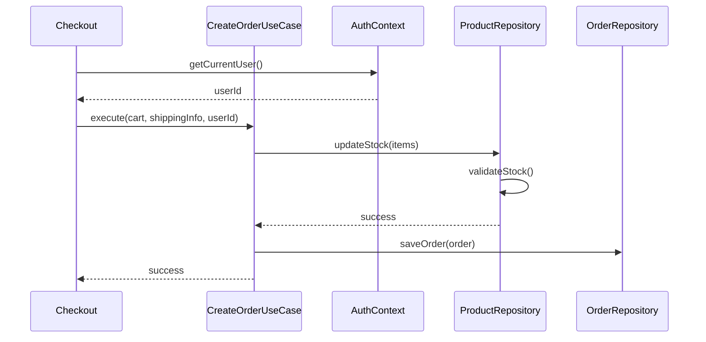

# Implementation Plan: Phase 3 - UX Polish (Auth, Stock, Motion)

**Status**: 🔄 In Progress
**Started**: 2026-01-31
**Last Updated**: 2026-01-31
**Estimated Completion**: 2026-02-05

---

**⚠️ CRITICAL INSTRUCTIONS**: After completing each phase:
1. ✅ Check off completed task checkboxes
2. 🧪 Run all quality gate validation commands
3. ⚠️ Verify ALL quality gate items pass
4. 📅 Update "Last Updated" date above
5. 📝 Document learnings in Notes section
6. ➡️ Only then proceed to next phase

⛔ **DO NOT skip quality gates or proceed with failing checks**

---

## 📋 Overview

### Feature Description
쇼핑몰의 완성도를 높이기 위해 사용자 인증(Mock Auth), 상품 재고 관리(Persistence), 그리고 UI 인터랙션 애니메이션을 추가합니다. 이를 통해 정적인 목업 사이트에서 동적인 실제 애플리케이션으로 사용자 경험을 격상시킵니다.

### Success Criteria
- [ ] 상품 데이터가 LocalStorage에 저장되어 재고 차감(Stock Deduction)이 영구적으로 반영됨
- [ ] `AuthContext`를 통해 로그인/로그아웃이 가능하고, 주문 시 실제 사용자 ID가 반영됨
- [ ] 장바구니 열기, 페이지 이동 시 부드러운 애니메이션(Framer Motion) 적용

---

## 🗺️ Context Map
- **Repositories**: 
  - `src/data/repositories/MockProductRepository.ts` (To be refactored to `LocalStorageProductRepository`)
  - `src/data/sources/MockProductDataSource.ts` (Seed data)
- **Use Cases**: 
  - `src/domain/use-cases/order/CreateOrderUseCase.ts` (Update logic for stock deduction & userId)
- **UI Components**:
  - `src/presentation/components/CartDrawer.tsx` (Animation)
  - `src/presentation/components/ProductList.tsx` (Animation)
  - `src/app/layout.tsx` (Auth Provider)

---

## 🏗️ Architecture & Design

### Visualization (Mermaid)

#### Sequence Diagram (Order with Stock Deduction)


### Architecture Decisions
| Decision | Rationale | Trade-offs |
|----------|-----------|------------|
| **LocalStorage for Products** | 재고 차감 상태를 유지하기 위해 정적 배열(Mock Data)을 브라우저 저장소로 이관 | 최초 로드 시 시딩(Seeding) 로직 필요 |
| **AuthContext** | 전역적인 사용자 상태 관리를 위해 Context API 사용 (Mock 구현) | 보안성은 고려하지 않음 (MVP 레벨) |
| **Framer Motion** | React 생태계 표준 애니메이션 라이브러리 채택 | 번들 사이즈 증가 |

---

## 🧪 Test Specification

### Test Scenarios
- [ ] **Stock**: 주문 시 재고가 부족하면 에러가 발생해야 함 (`Insufficient stock`)
- [ ] **Auth**: 로그인되지 않은 상태에서 주문 시도 시 에러 또는 리다이렉트
- [ ] **Persistence**: 페이지 새로고침 후에도 차감된 재고가 유지되어야 함

### Coverage Target
- **Use Cases**: 100% (Refactored logic)
- **Repositories**: 100% (New LocalStorage Implementation)

---

## 🚀 Implementation Phases

### Phase 1: Product Persistence & Stock Logic
**Goal**: 상품 데이터를 LocalStorage로 옮기고 재고 관리 로직 구현
**Estimated Time**: 3 hours
**Status**: ✅ Complete

#### Tasks

**🔴 RED: Write Failing Tests First**
- [x] **Task 1.1**: `tests/unit/data/repositories/LocalStorageProductRepository.test.ts` 작성
  - 시딩(Seeding) 및 재고 업데이트 테스트
- [x] **Task 1.2**: `CreateOrderUseCase.test.ts` 업데이트 (재고 부족 실패 케이스 추가)

**🟢 GREEN: Implement to Make Tests Pass**
- [x] **Task 1.3**: `ProductRepository` 인터페이스에 `updateStock` 메서드 추가
- [x] **Task 1.4**: `src/data/repositories/LocalStorageProductRepository.ts` 구현 (기존 MockRepo 대체)
  - `MockProductDataSource.ts` 데이터를 초기값으로 사용
- [x] **Task 1.5**: `CreateOrderUseCase`에 재고 차감 로직 추가

**🔵 REFACTOR: Clean Up Code**
- [x] **Task 1.6**: DI 컨테이너(또는 Hooks)에서 Repository 교체

#### Quality Gate ✋

**Executable Verification Command:**
```bash
npm test tests/unit/data/repositories/LocalStorageProductRepository.test.ts tests/unit/domain/use-cases/order/CreateOrderUseCase.test.ts && npm run lint
```

---

### Phase 2: User Authentication (Mock)
**Goal**: 사용자 로그인/로그아웃 및 주문 연동
**Estimated Time**: 2 hours
**Status**: ✅ Complete

#### Tasks

**🔴 RED: Write Failing Tests First**
- [x] **Task 2.1**: `tests/unit/presentation/context/AuthContext.test.tsx` 작성

**🟢 GREEN: Implement to Make Tests Pass**
- [x] **Task 2.2**: `src/domain/entities/User.ts` 정의
- [x] **Task 2.3**: `src/presentation/context/AuthContext.tsx` 구현 (Simple login/logout)
- [x] **Task 2.4**: `Header` 컴포넌트에 로그인/로그아웃 버튼 추가
- [x] **Task 2.5**: `useCheckout` 및 `OrdersPage`가 `AuthContext`의 `user.id`를 사용하도록 수정

#### Quality Gate ✋

**Executable Verification Command:**
```bash
npm test tests/unit/presentation/context/AuthContext.test.tsx && npm run build
```

---

### Phase 3: UI Animation & Polish
**Goal**: Framer Motion을 활용한 생동감 있는 UI 구현
**Estimated Time**: 3 hours
**Status**: ✅ Complete

#### Tasks

- [x] **Task 3.1**: `framer-motion` 설치
- [x] **Task 3.2**: `CartDrawer` 슬라이드 애니메이션 적용 (`AnimatePresence`)
- [x] **Task 3.3**: `ProductList` 스크롤 시 순차 등장(Stagger) 애니메이션 적용
- [x] **Task 3.4**: 버튼 클릭 인터랙션 (`whileTap`) 추가

#### Quality Gate ✋

**Executable Verification Command:**
```bash
npm run build
```

---

## 📊 Progress Tracking

### Completion Status
- **Phase 1**: ✅ 100%
- **Phase 2**: ✅ 100%
- **Phase 3**: ✅ 100%

**Overall Progress**: 100% complete

---

## 🔄 Rollback Strategy
- **Command**: `git checkout HEAD~1`
- **Files to Restore**: `src/data/repositories/MockProductRepository.ts`

---

## 📝 Notes & Learnings
- (작성 예정)
