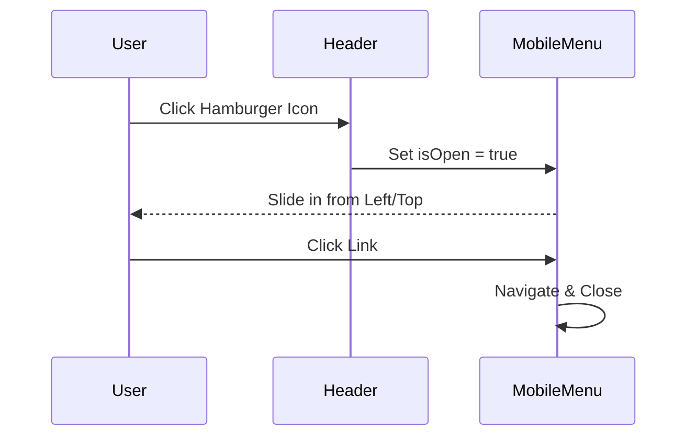

# Implementation Plan: Polish & Mobile Optimization

**Status**: 🔄 In Progress
**Started**: 2026-01-31
**Last Updated**: 2026-01-31
**Estimated Completion**: 2026-02-02

---

**⚠️ CRITICAL INSTRUCTIONS**: After completing each phase:
1. ✅ Check off completed task checkboxes
2. 🧪 Run all quality gate validation commands
3. ⚠️ Verify ALL quality gate items pass
4. 📅 Update "Last Updated" date above
5. 📝 Document learnings in Notes section
6. ➡️ Only then proceed to next phase

⛔ **DO NOT skip quality gates or proceed with failing checks**

---

## 📋 Overview

### Feature Description
현재 데스크탑 중심으로 구현된 UI를 모바일 환경에서도 완벽하게 동작하도록 반응형 디자인을 강화하고, 시각적 디테일(Typography, Micro-interaction)을 다듬어 상용 서비스 수준의 완성도를 확보합니다.

### Success Criteria
- [ ] 모바일(375px~)에서 가로 스크롤이나 레이아웃 깨짐이 없어야 함
- [ ] 모바일 헤더의 햄버거 메뉴 클릭 시 네비게이션 드로어가 정상 작동해야 함
- [ ] 모든 버튼과 링크에 호버/클릭 피드백(Interaction)이 있어야 함
- [ ] Lighthouse 성능/접근성 점수 90점 이상 달성

---

## 🗺️ Context Map
- **Components to Polish**:
  - `src/presentation/components/Header.tsx` (Mobile Menu)
  - `src/app/page.tsx` (Hero Section Responsive)
  - `src/app/checkout/page.tsx` (Form Layout on Mobile)
  - `src/presentation/components/ProductList.tsx` (Grid Layout)
  - `src/presentation/components/CartDrawer.tsx` (Mobile Width)

---

## 🏗️ Architecture & Design

### Visualization (Mobile Nav Flow)


### UX Decisions
| Decision | Rationale | Trade-offs |
|----------|-----------|------------|
| **Full-screen Mobile Menu** | 좁은 화면에서 터치 영역을 충분히 확보하기 위해 모바일 메뉴는 전체 화면으로 제공 | 데스크탑과 다른 별도 컴포넌트 관리 필요 |
| **Grid Layout Adjustment** | 모바일에서는 1열, 태블릿 2열, 데스크탑 4열로 상품 목록 배치 (`grid-cols-1 md:grid-cols-2...`) | 화면 크기에 따라 이미지가 커보일 수 있음 |

---

## 🧪 Test Specification

### Test Scenarios
- [ ] **Mobile View**: 뷰포트를 모바일 사이즈로 줄였을 때 햄버거 메뉴가 나타나고, 클릭 시 메뉴가 열려야 함.
- [ ] **Checkout Responsive**: 모바일에서 결제 폼 입력 시 키보드에 의해 UI가 가려지지 않고 적절히 배치되어야 함.

### Coverage Target
- **UI Components**: 기존 테스트 유지 (스타일 변경 위주이므로 로직 테스트는 불변)

---

## 🚀 Implementation Phases

### Phase 1: Mobile Header & Navigation
**Goal**: 모바일 전용 네비게이션 메뉴 구현 및 헤더 반응형 처리
**Estimated Time**: 2 hours
**Status**: ✅ Complete

#### Tasks

**🔴 RED: Write Failing Tests First**
- [x] **Task 1.1**: `tests/unit/presentation/components/Header.test.tsx`에 모바일 메뉴 열기/닫기 테스트 추가

**🟢 GREEN: Implement to Make Tests Pass**
- [x] **Task 1.2**: `Header.tsx`에 `MobileMenu` 컴포넌트(Framer Motion 적용) 추가 및 상태 연결
- [x] **Task 1.3**: 뷰포트 크기에 따른 `Header` 레이아웃 조정 (로고 크기, 패딩 등)

**🔵 REFACTOR: Clean Up Code**
- [x] **Task 1.4**: `MobileMenu` 별도 컴포넌트로 분리 고려 (통합 구현됨)

#### Quality Gate ✋

**Executable Verification Command:**
```bash
npm test tests/unit/presentation/components/Header.test.tsx && npm run build
```

---

### Phase 2: Page Layout Optimization
**Goal**: 주요 페이지(메인, 상세, 체크아웃)의 모바일 레이아웃 최적화
**Estimated Time**: 3 hours
**Status**: ✅ Complete

#### Tasks

- [x] **Task 2.1**: `src/app/page.tsx` 히어로 섹션 폰트 사이즈 및 마진 반응형 조정 (`text-5xl` -> `text-3xl` on mobile)
- [x] **Task 2.2**: `ProductList` 그리드 반응형 점검 (이미 `grid-cols-1` 적용됨, 간격 미세 조정)
- [x] **Task 2.3**: `CheckoutPage` 2열 레이아웃을 모바일에서 1열로 스택(`flex-col-reverse` 등) 처리하여 주문 요약이 적절한 위치에 오도록 조정
- [x] **Task 2.4**: `CartDrawer` 모바일에서 너비 100%(`w-full`) 적용

#### Quality Gate ✋

**Executable Verification Command:**
```bash
npm run build
```

---

### Phase 3: Visual Polish & Micro-interactions
**Goal**: 버튼, 링크, 이미지 등 디테일한 시각적 완성도 향상
**Estimated Time**: 2 hours
**Status**: ✅ Complete

#### Tasks

- [x] **Task 3.1**: 모든 버튼(`button`)에 `active:scale-95` 또는 `hover:opacity-80` 등 통일된 인터랙션 클래스 적용
- [x] **Task 3.2**: `next/image`의 `placeholder="blur"` 적용을 위한 `blurDataURL` 생성 유틸리티 추가 (또는 고정 컬러 placeholder)
- [x] **Task 3.3**: 전반적인 타이포그래피(자간, 행간) 점검 및 `tracking-tight` 적용 확대

#### Quality Gate ✋

**Executable Verification Command:**
```bash
npm run build
```

---

## 📊 Progress Tracking

### Completion Status
- **Phase 1**: ✅ 100%
- **Phase 2**: ✅ 100%
- **Phase 3**: ✅ 100%

**Overall Progress**: 100% complete

---

## 🔄 Rollback Strategy
- **Command**: `git checkout HEAD~1`
- **Files to Restore**: `src/presentation/components/Header.tsx`, `src/app/globals.css`

---

## 📝 Notes & Learnings
- (작성 예정)
