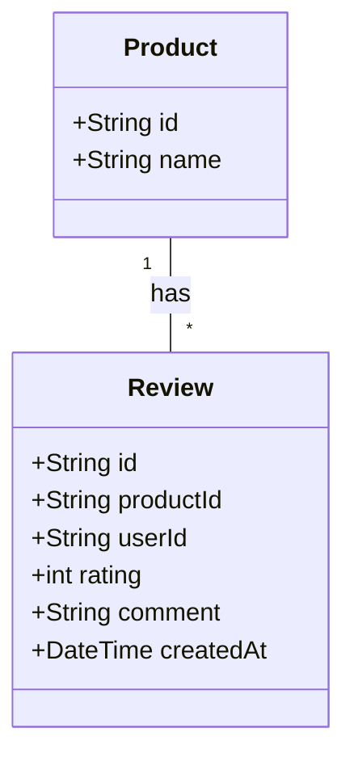
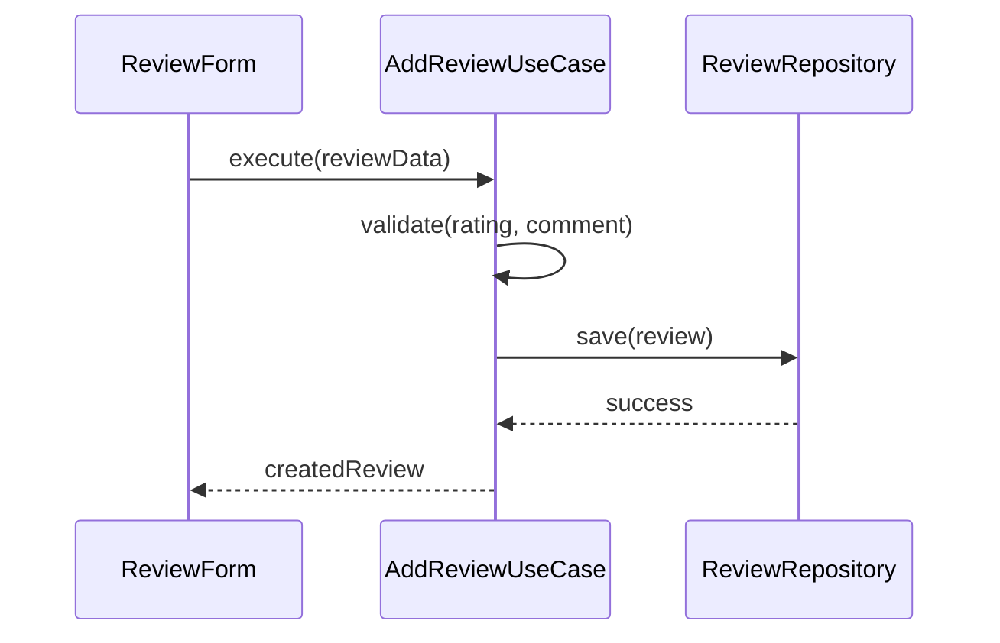

# Implementation Plan: Product Review System (Pilot v2)

**Status**: 🔄 In Progress
**Started**: 2026-01-31
**Last Updated**: 2026-01-31
**Estimated Completion**: 2026-02-01

---

**⚠️ CRITICAL INSTRUCTIONS**: After completing each phase:
1. ✅ Check off completed task checkboxes
2. 🧪 Run all quality gate validation commands
3. ⚠️ Verify ALL quality gate items pass
4. 📅 Update "Last Updated" date above
5. 📝 Document learnings in Notes section
6. ➡️ Only then proceed to next phase

⛔ **DO NOT skip quality gates or proceed with failing checks**

---

## 📋 Overview

### Feature Description
사용자가 구매한 상품에 대해 별점과 텍스트 리뷰를 남길 수 있는 기능을 구현합니다. 이 문서는 Feature Planner 2.0 템플릿의 유효성을 검증하기 위한 파일럿 프로젝트입니다.

### Success Criteria
- [ ] 리뷰 엔티티 및 도메인 로직 구현
- [ ] 특정 상품의 리뷰 목록 조회 기능
- [ ] 리뷰 작성 기능 (Mock 데이터 기반)

---

## 🗺️ Context Map
*Agent should read these files before starting implementation to understand the existing context.*

- **Core Entities**: `src/domain/entities/Product.ts`
- **Use Cases**: `src/domain/use-cases/GetProductByIdUseCase.ts`
- **Data Source**: `src/data/sources/MockProductDataSource.ts`
- **Existing Tests**: `tests/unit/domain/Product.test.ts`

---

## 🏗️ Architecture & Design

### Visualization (Mermaid)
*Visual representation of the logic and structure.*

#### Class Diagram (Domain Model)


#### Sequence Diagram (Add Review Flow)


### Architecture Decisions
| Decision | Rationale | Trade-offs |
|----------|-----------|------------|
| **Review Entity 분리** | 상품과 리뷰의 생명주기가 다르며, 확장성을 고려하여 독립된 엔티티로 설계 | 데이터 조회 시 조인 로직 필요 |
| **In-Memory Repository** | 파일럿 단계이므로 별도의 DB 없이 Mock 데이터 소스 활용 | 새로고침 시 데이터 유실 |

---

## 🧪 Test Specification

### Test Scenarios
- [ ] **Scenario 1**: 유효한 리뷰 데이터 저장 시 성공 -> `expect(result.rating).toBe(5)`
- [ ] **Scenario 2**: 별점이 1~5 범위를 벗어날 경우 에러 발생 -> `expect(error).toThrow('Invalid rating')`

### Coverage Target
- **Domain/Logic**: 100%
- **Presentation**: N/A (Phase 1 focus)

---

## 🚀 Implementation Phases

### Phase 1: Review Domain & Entity
**Goal**: 리뷰 엔티티 정의 및 유효성 검사 로직 구현
**Estimated Time**: 1 hour
**Status**: ⏳ Pending

#### Tasks

**🔴 RED: Write Failing Tests First**
- [ ] **Task 1.1**: `tests/unit/domain/Review.test.ts` 생성
- [ ] **Task 1.2**: 별점 유효성 및 필수 필드 누락 테스트 작성

**🟢 GREEN: Implement to Make Tests Pass**
- [ ] **Task 1.3**: `src/domain/entities/Review.ts` 구현
- [ ] **Task 1.4**: 유효성 검사 로직 추가하여 테스트 통과

**🔵 REFACTOR: Clean Up Code**
- [ ] **Task 1.5**: 엔티티 생성자 및 Getter 정리

#### Quality Gate ✋

**Executable Verification Command:**
```bash
npm test tests/unit/domain/Review.test.ts && npm run lint
```

**Checklist:**
- [ ] 리뷰 엔티티 단위 테스트 100% 통과
- [ ] ESLint 에러 없음

---

## 📊 Progress Tracking

### Completion Status
- **Phase 1**: ⏳ 0%

**Overall Progress**: 0% complete

---

## 🔄 Rollback Strategy
- **Command**: `git checkout HEAD -- src/domain/entities/Review.ts`
- **Files to Restore**: `src/domain/entities/Review.ts`, `tests/unit/domain/Review.test.ts`

---

## 📝 Notes & Learnings
- (작성 예정)
